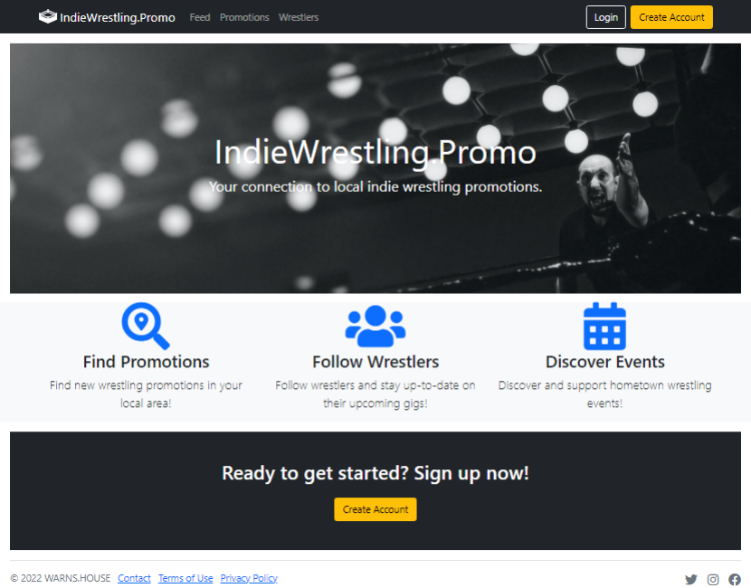

# IndieWrestling.Promo
An app that connects independent wrestling promotions with fans. Wooo!

**Link to project:** Coming soon!

## How It's Made:

**Tech used:** Bootstrap, EJS, JavaScript, Node.js, Mongoose, MongoDB, Cloudinary, Bcrypt, Passport.js, Multer, Nodemailer

This app was built using the MVC architectural pattern, and it employs a variety of Node.js middleware for its functionality – Passport.js for user authentication, Bcrypt for password-hashing, Multer for image uploading, and Nodemailer for sending e-mail. MongoDB is used for the storage of all user-related data and Cloudinary is used for image storage. The app is intended to help increase the visibility of independent wrestling promotions and to allow them to better promote their events to fans.

The app allows for 4 distinct user types – fans, wrestlers, promotion owners, and admins. Fans are the most basic user type, and can follow wrestlers and promotions as well as comment on posts and events. Wrestlers can do everything a fan can, and additionally have a specialized profile page and can create posts. Owners have all the perks of a wrestler but can also create promotions and events. Lastly, admins have the most power of all over creating and managing content and are uniquely capable of assigning user types.

## Optimizations:

There are many aspects of the app which I would like to further refine and expand upon in the future. For example, a search function which allows users to search for wrestlers, owners, and promotions by both name and geographic location would be useful. Incorporating win-loss statistics into wrestler profiles would be interesting, and implementing the ability for promotions to sell tickets to events via the app seems a worthwhile challenge.

## Lessons Learned:

This app was one of my weightiest undertakings to date and it provided me with tremendous insight into designing and implementing a full app using the MVC paradigm. Along with that, I also picked up other tidbits of knowledge such as the intricacies of database searches and Gmail being a poor candidate for use with Nodemailer nowadays.

## How To Run It Locally:

1. Ensure that you have Git and Node.js installed.
2. Clone this repository (e.g., with `git clone https://github.com/warnshouse/indiewrestling.promo.git`).
3. Move into the directory with `cd indiewrestling.promo`.
4. Install the necessary dependencies with `npm install`.
5. Create a `.env` file in the `config` folder, and set the following variables:
  - PORT=`3000` (or any available port of your choosing)
  - MONGODB_URI=`your MongoDB URI`
  - SESSION_SECRET=`string of your choosing`
  - CLOUDINARY_CLOUD_NAME=`your Cloudinary cloud name`
  - CLOUDINARY_API_KEY=`your Cloudinary API key`
  - CLOUDINARY_API_SECRET=`your Cloudinary API secret`
  - GMAIL_USER=`your Gmail address` (for Nodemailer)
  - GMAIL_PASSWORD=`your Gmail password` (for Nodemailer)
6. Start the server with `npm start`.
7. Navigate to `localhost:3000` in your web browser and you're set!
